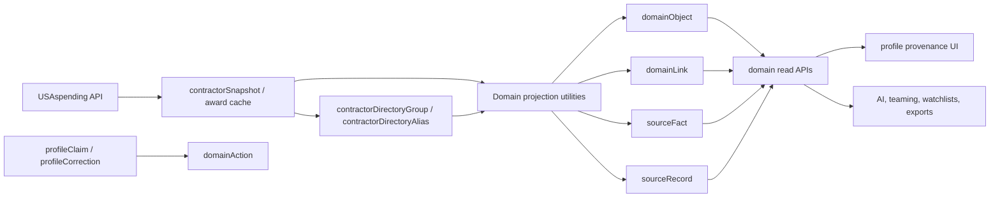

# feat: Build contractor intelligence operating layer

## Overview

Build a domain-specific data operating layer for `military.contractors` inspired by OpenFoundry concepts, without adopting OpenFoundry's code, license, stack, or general-purpose platform scope.

The layer should turn the current USAspending-backed directory into a structured contractor intelligence foundation: domain objects, source facts, provenance, links, object sets, and governed actions. It should remain small, additive, and tailored to defense contractor intelligence.

The implementation must include comprehensive documentation explaining why this layer exists, why OpenFoundry is not being used directly, how the model works, and which future use cases it enables.

---

## Problem Frame

`military.contractors` already has the beginning of a contractor intelligence foundation:

- raw USAspending recipient snapshots in `contractorSnapshot`
- canonical public contractor groups in `contractorDirectoryGroup`
- raw alternate recipient names in `contractorDirectoryAlias`
- cached award intelligence in `recipientEntity`, `award`, `awardTransaction`, and `explorerQueryCache`
- claimed profile and correction workflows in `profileClaim` and `profileCorrection`
- initial signal methodology in `docs/contractor-intelligence-signals.md`

The missing piece is a documented, explicit operating model that connects these pieces into a reusable domain layer. Without that layer, future features such as teaming discovery, AI dossiers, watchlists, institutional exports, merge/split reviews, and provenance-aware profile pages will each invent their own data interpretation rules.

OpenFoundry is useful prior art conceptually, but it is a large AGPL-licensed Go/Kubernetes data platform. This application needs a focused Nuxt/libSQL implementation that preserves the same useful concepts at a much smaller scale.

---

## Requirements Trace

- R1. Do not import, copy, vendor, or adapt OpenFoundry source code; use only high-level architectural concepts.
- R2. Keep the solution domain-specific to defense contractor intelligence, not a generic data platform.
- R3. Preserve raw USAspending facts as source-backed records and never silently overwrite them with curated or contractor-submitted context.
- R4. Model contractors, recipients, awards, agencies, NAICS, PSC, locations, source records, claims, corrections, and signals as explicit domain concepts.
- R5. Add provenance so every derived fact can explain source API, source URL, raw record hash, refresh time, confidence, and derivation method.
- R6. Add links between domain objects so profile, search, AI, teaming, and institutional features can reuse one relationship graph.
- R7. Treat user/admin changes as governed actions with auditability and status transitions.
- R8. Add internal domain query APIs for object lookup, lineage, links, and future object sets.
- R9. Expose provenance and source separation in public profile UI without blocking the profile shell on live USAspending calls.
- R10. Write comprehensive documentation covering rationale, architecture, methodology, operating rules, and future use cases.
- R11. Keep database changes additive and reversible; do not replace current directory, snapshot, or intelligence tables.
- R12. Add deterministic tests for projection, provenance, links, API contracts, and UI states where behavior changes.

---

## Scope Boundaries

### In Scope

- Documentation-first plan and architecture docs.
- Additive Drizzle schema for domain objects, links, facts, source records, actions, and optional object sets.
- Projection utilities that derive domain objects and links from existing snapshot/intelligence tables.
- Provenance helpers for source-backed facts.
- Internal read APIs for domain objects, links, and lineage.
- Integration with existing profile claim/correction flows as governed actions.
- Public profile UI additions that explain source provenance and object relationships.
- Tests for deterministic projection and source separation.

### Out of Scope

- Replacing the current directory tables.
- Migrating to OpenFoundry, Go microservices, Kubernetes, Kafka, Postgres, Iceberg, Vespa, Temporal, or Protobuf.
- Copying OpenFoundry implementation code, schemas, service contracts, docs, or generated clients.
- Building a generic user-configurable ontology builder.
- Public A-F contractor grades.
- Paid correction, paid ranking, or score-improvement workflows.
- Full SAM.gov enrichment in this pass.
- Parent/subsidiary hierarchy resolution beyond documenting the future model.
- Full marketplace, messaging, CRM, or institutional billing flows.

### Deferred to Follow-Up Work

- Human merge/split review UI.
- Domain object set builder and saved lists.
- Watchlists and alerts.
- AI-generated dossiers grounded in source facts.
- SAM.gov enrichment and CAGE/UEI expansion.
- Parent/subsidiary corporate hierarchy.
- Teaming discovery workflows.
- Bulk exports and institutional API access.
- Data quality dashboard for source freshness, missing fields, and projection drift.

---

## Context & Research

### OpenFoundry Assessment

OpenFoundry describes itself as an open-source operational data platform inspired by Palantir Foundry. The repository includes Go services, shared libraries, Protobuf/OpenAPI contracts, generated SDKs, React 19 + Vite frontend, and Kubernetes-oriented infrastructure.

Relevant concepts to borrow:

- ontology-centered object modeling
- links between operational entities
- source-backed datasets and lineage
- governed actions
- object sets and search surfaces
- AI retrieval grounded in structured objects
- documentation that explains capability areas and future extensibility

Reasons not to use it directly:

- It is AGPL-3.0-only, which creates licensing risk for this application.
- It is architecturally far heavier than this Nuxt/libSQL application.
- It is general-purpose platform infrastructure, while this product is a focused public contractor directory and intelligence layer.
- Its operational requirements are incompatible with the current lightweight deployment model.
- Some areas appear actively evolving and not appropriate as a stable dependency for this app.

### Relevant Code and Patterns

- `server/database/schema/snapshot.ts` already defines `contractorSnapshot`, `contractorSnapshotRun`, `contractorDirectoryGroup`, and `contractorDirectoryAlias`.
- `server/database/schema/intelligence.ts` already defines `recipientEntity`, `agency`, `naicsCode`, `pscCode`, `award`, `awardTransaction`, and `explorerQueryCache`.
- `server/database/schema/directory.ts` defines curated contractor overlays and `profileClaim`.
- `server/database/schema/admin.ts` defines `profileCorrection` and `adminActivityLog`.
- `server/utils/contractor-snapshot.ts` owns snapshot refresh, canonical grouping, alias lookup, profile shell assembly, and grouped directory search.
- `server/utils/intelligence.ts` owns USAspending award intelligence, persistent cache behavior, and signal construction.
- `server/api/contractors/index.get.ts`, `server/api/contractors/[slug].get.ts`, `server/api/contractors/[slug]/intelligence.get.ts`, and `server/api/search.get.ts` expose current public reads.
- `server/api/profile-claims/index.post.ts` and `server/api/profile-corrections/index.post.ts` are the current governed-action entry points.
- `app/pages/[slug].vue` is the canonical profile page and already separates local profile shell from async intelligence loading.
- `docs/contractor-intelligence-signals.md`, `docs/database-schema.md`, `prd.md`, and `README.md` establish source-backed trust boundaries.

### Existing Constraints

- Use Nuxt 4 patterns and `import.meta.client` where needed.
- Do not import from `#imports` manually.
- Use `@/app/` prefix for app imports.
- Use Drizzle + libSQL/SQLite.
- Use zod for API validation.
- Use `useLogger()` instead of `console.*`.
- For new UI/styling work, invoke `ce-frontend-design` before implementation.
- After code changes, run the project verification required by repository instructions. Current `package.json` does not define `check`, so implementation must reconcile that gap before final verification.

---

## Key Technical Decisions

- Build a domain-specific layer, not a generic ontology platform: The product value is defense contractor intelligence, so the data model should name contractor concepts directly.
- Keep current source tables authoritative: `contractorSnapshot`, `contractorDirectoryGroup`, `contractorDirectoryAlias`, `award`, and related tables remain the source of operational data.
- Add projections instead of replacing tables: New domain tables should index and explain existing data, not become a hidden second source of truth.
- Store provenance separately from display copy: Facts should have machine-readable source metadata; UI copy should be derived from those records.
- Treat actions as audit records: Claims, corrections, merge/split decisions, source refreshes, and future admin overrides should produce governed action records.
- Use stable object keys: Domain objects should be addressable by deterministic keys such as `contractor:<slug>`, `recipient:<uei-or-code-or-snapshot-id>`, and `award:<award-id>`.
- Keep public profile reads local-first: Domain APIs and profile pages must not call USAspending live during ordinary public reads.
- Document future use cases now, but do not implement them prematurely: The docs should explain extensibility without claiming features are live.

---

## High-Level Technical Design

This illustrates the intended approach and is directional guidance for review, not implementation specification. The implementing agent should treat it as context, not code to reproduce.



### Conceptual Model

| Concept | Meaning | Current anchor |
| --- | --- | --- |
| Domain object | A real-world or operational entity | contractor groups, recipients, awards, agencies, codes |
| Domain link | Relationship between objects | contractor-recipient, award-agency, award-NAICS, award-PSC |
| Source record | Raw/API source record or source fetch | snapshot rows, award rows, USAspending URLs |
| Source fact | Individual field-level claim with provenance | obligations, award count, identifiers, top agency/code values |
| Domain action | Governed user/admin operation | claims, corrections, merge/split reviews, refreshes |
| Object set | Saved or computed object collection | future teaming/watchlist/ranking sets |

---

## Output Structure

Expected new or changed documentation/code shape:

```text
docs/
  contractor-intelligence-operating-layer.md
  domain-ontology.md
  provenance-methodology.md
  database-schema.md
  contractor-intelligence-signals.md
  plans/
    2026-05-15-001-feat-contractor-intelligence-operating-layer-plan.md
app/
  components/Contractors/
    ContractorObjectLinks.vue
    ContractorObjectLinks.spec.ts
    ContractorProvenancePanel.vue
    ContractorProvenancePanel.spec.ts
  types/
    domain-ontology.types.ts
server/
  api/domain/
    lineage/[objectKey].get.ts
    object-sets/index.get.ts
    objects/index.get.ts
    objects/[type]/[id].get.ts
  database/schema/
    domain.ts
    index.ts
  database/migrations/
    0015_domain_operating_layer.sql
  utils/
    domain-ontology.ts
    domain-ontology.spec.ts
    provenance.ts
    provenance.spec.ts
```

The tree is a scope declaration, not a rigid implementation constraint. If execution reveals a cleaner layout, keep the same boundaries and update this plan.

---

## Implementation Units

- [ ] U1. **Save architecture plan and documentation scaffold**

**Goal:** Establish the durable plan and initial docs before implementation.

**Requirements:** R1, R2, R10

**Dependencies:** None

**Files:**

- Create: `docs/plans/2026-05-15-001-feat-contractor-intelligence-operating-layer-plan.md`
- Create: `docs/contractor-intelligence-operating-layer.md`
- Create: `docs/domain-ontology.md`
- Create: `docs/provenance-methodology.md`
- Modify: `README.md`
- Modify: `prd.md`

**Approach:**

- Document the OpenFoundry assessment and why this app is building a domain-specific version instead.
- Define core vocabulary: objects, links, facts, provenance, actions, object sets.
- Explain that this is additive and source-backed.
- Link the new docs from product docs without presenting future use cases as live.

**Patterns to follow:**

- Current concise product documentation in `README.md` and `prd.md`.
- Source-backed methodology style in `docs/contractor-intelligence-signals.md`.
- Existing roadmap structure in `docs/open-contractor-intelligence-pivot-plan.md`.

**Test scenarios:**

- Test expectation: none -- documentation-only unit.

**Verification:**

- Docs explain why OpenFoundry is not used directly.
- Docs define the domain layer in language a future implementer can follow.
- README/PRD link the docs and keep v1 directory positioning intact.

---

- [ ] U2. **Define domain types and additive schema**

**Goal:** Add explicit domain objects, links, source records, source facts, actions, and optional object sets to the database model.

**Requirements:** R3, R4, R5, R6, R7, R11

**Dependencies:** U1

**Files:**

- Create: `app/types/domain-ontology.types.ts`
- Create: `server/database/schema/domain.ts`
- Modify: `server/database/schema/index.ts`
- Create: `server/database/migrations/0015_domain_operating_layer.sql`
- Modify: `docs/database-schema.md`
- Test: `server/utils/domain-ontology.spec.ts`

**Approach:**

- Define stable object type enum values for contractor, recipient, award, agency, NAICS, PSC, location, claim, correction, source record, and signal.
- Add `domainObject` with stable `objectKey`, `objectType`, display name, slug, source table reference, metadata, and timestamps.
- Add `domainLink` with `fromObjectKey`, `toObjectKey`, `linkType`, source/confidence metadata, and timestamps.
- Add `sourceRecord` for source API, source URL, source identifier, raw hash, retrieved/refreshed time, and raw metadata reference.
- Add `sourceFact` for object key, field name, value, source record, derivation method, confidence, and validity metadata.
- Add `domainAction` for governed operations and status.
- Add optional `domainObjectSet` only if the schema stays simple; otherwise defer object sets to U8.

**Patterns to follow:**

- Drizzle schema style in `server/database/schema/snapshot.ts` and `server/database/schema/intelligence.ts`.
- Existing timestamp/json column conventions.
- Existing index naming patterns.

**Test scenarios:**

- Happy path: schema types allow a contractor object, recipient object, award object, source record, fact, and link to be represented without `any`.
- Edge case: object metadata is optional and source references can point to existing tables without requiring a new source row for every object immediately.
- Error path: enum-like types reject unsupported object/link/action categories at validation boundaries.

**Verification:**

- Migration is additive and does not alter or drop existing tables.
- Schema exports are available from `server/database/schema/index.ts`.
- `docs/database-schema.md` documents the new layer and its relationship to existing source tables.

---

- [ ] U3. **Build provenance and projection utilities**

**Goal:** Project current directory/intelligence records into domain objects, links, source records, and source facts deterministically.

**Requirements:** R3, R4, R5, R6, R11, R12

**Dependencies:** U2

**Files:**

- Create: `server/utils/domain-ontology.ts`
- Create: `server/utils/provenance.ts`
- Modify: `server/utils/contractor-snapshot.ts`
- Modify: `server/utils/intelligence.ts`
- Test: `server/utils/domain-ontology.spec.ts`
- Test: `server/utils/provenance.spec.ts`

**Approach:**

- Add pure helpers for stable object keys and source record hashes.
- Project `contractorDirectoryGroup` into contractor domain objects.
- Project `contractorDirectoryAlias` / `contractorSnapshot` into recipient domain objects and contractor-recipient links.
- Project `award` records into award objects and links to contractor/recipient, agency, NAICS, and PSC objects.
- Project source-backed fields into `sourceFact` rows with derivation methods such as `usaspending_snapshot`, `usaspending_award_cache`, `canonical_group_aggregate`, and `curated_overlay`.
- Keep projection idempotent using deterministic keys and upserts.

**Patterns to follow:**

- Current stable ID/hash helpers and grouping logic in `server/utils/contractor-snapshot.ts`.
- Source metadata construction in `server/utils/intelligence.ts`.
- USAspending source URL construction in `server/utils/usaspending.ts`.

**Test scenarios:**

- Happy path: one grouped contractor with two aliases produces one contractor object, two recipient objects, two contractor-recipient links, and source facts for aggregate obligations and award count.
- Happy path: one award produces an award object and links to recipient, agency, NAICS, and PSC objects when those fields exist.
- Edge case: missing UEI/recipient code falls back to a stable snapshot-based recipient key without merging unrelated recipients.
- Edge case: repeated projection produces the same object keys and does not duplicate links/facts.
- Error path: malformed source metadata produces low-confidence facts with caveats rather than throwing during public reads.

**Verification:**

- Projection helpers are deterministic and covered by unit tests.
- Existing public directory behavior remains unchanged until APIs/UI consume the layer.

---

- [ ] U4. **Add domain read APIs**

**Goal:** Expose internal read surfaces for domain objects, links, lineage, and future object sets.

**Requirements:** R5, R6, R8, R12

**Dependencies:** U2, U3

**Files:**

- Create: `server/api/domain/objects/index.get.ts`
- Create: `server/api/domain/objects/[type]/[id].get.ts`
- Create: `server/api/domain/lineage/[objectKey].get.ts`
- Create: `server/api/domain/object-sets/index.get.ts` if object sets are included in U2
- Test: `server/api/domain/objects/index.get.spec.ts`
- Test: `server/api/domain/objects/[type]/[id].get.spec.ts`
- Test: `server/api/domain/lineage/[objectKey].get.spec.ts`

**Approach:**

- Use zod to validate query params and route params.
- Keep endpoints read-only initially.
- Return object identity, display fields, links, facts, source records, and freshness/provenance metadata.
- Support filtered object lists by type, search query, source table, and limit/offset.
- Make lineage endpoint return source facts and links needed to explain an object's displayed profile facts.

**Patterns to follow:**

- `server/api/contractors/index.get.ts` for thin route handlers over utility functions.
- `server/api/search.get.ts` for paginated response shape.
- `server/api/contractors/[slug].get.ts` for local-first profile data composition.

**Test scenarios:**

- Happy path: object list returns contractor objects with pagination metadata.
- Happy path: object detail returns links and source facts for a known contractor object.
- Happy path: lineage endpoint returns source URL, source API, raw hash, derived field, and confidence for a contractor obligation fact.
- Edge case: missing object returns 404 with a useful status message.
- Edge case: unsupported object type returns 400.
- Error path: database query failures map to 500 without leaking internals.

**Verification:**

- APIs do not call USAspending live.
- Responses are typed and stable enough for profile UI and future AI use.

---

- [ ] U5. **Record claims and corrections as governed actions**

**Goal:** Connect existing profile claim/correction flows to the domain action model without changing public source facts.

**Requirements:** R3, R7, R11, R12

**Dependencies:** U2, U3

**Files:**

- Modify: `server/api/profile-claims/index.post.ts`
- Modify: `server/api/profile-corrections/index.post.ts`
- Modify: `server/utils/profile-submissions.ts`
- Modify: `server/database/schema/admin.ts` only if additional references are needed
- Modify: `server/database/schema/directory.ts` only if additional references are needed
- Test: `server/utils/profile-submissions.spec.ts`

**Approach:**

- When a claim or correction is submitted, create or link a `domainAction` row.
- Record action type, actor/user, target object key, status, submitted payload, source evidence URL, and timestamps.
- Keep correction state separate from source facts until admin review accepts a curated overlay or explanatory note.
- Ensure action metadata can support future admin review, notifications, and audit timelines.

**Patterns to follow:**

- Existing auth requirement and zod validation in `server/api/profile-claims/index.post.ts` and `server/api/profile-corrections/index.post.ts`.
- Existing target resolution in `server/utils/profile-submissions.ts`.
- Existing `adminActivityLog` shape in `server/database/schema/admin.ts`.

**Test scenarios:**

- Happy path: submitting a profile claim creates the existing claim row and a pending domain action targeting the canonical contractor object.
- Happy path: submitting a correction creates the existing correction row and a pending domain action with the target field recorded.
- Edge case: alias slugs resolve to the canonical contractor object key.
- Error path: unauthenticated submissions are rejected before creating domain actions.
- Error path: invalid target slug returns a validation/not-found error without partial writes.

**Verification:**

- Claims/corrections remain compatible with existing API responses.
- Domain actions are queryable for future admin and audit use.

---

- [ ] U6. **Surface provenance and links on contractor profiles**

**Goal:** Make source provenance and domain relationships visible on the canonical contractor profile page.

**Requirements:** R3, R5, R6, R9, R12

**Dependencies:** U4

**Files:**

- Modify: `app/pages/[slug].vue`
- Create: `app/components/Contractors/ContractorProvenancePanel.vue`
- Create: `app/components/Contractors/ContractorObjectLinks.vue`
- Test: `app/components/Contractors/ContractorProvenancePanel.spec.ts`
- Test: `app/components/Contractors/ContractorObjectLinks.spec.ts`

**Execution note:** Invoke `ce-frontend-design` before implementing this unit.

**Approach:**

- Add a compact provenance section showing source system, refresh window, source links, source-backed facts, and caveats.
- Add a relationship section showing linked recipients/aliases, top agencies, NAICS, PSC, and recent award relationships when available.
- Visually distinguish USAspending facts, curated profile overlays, and contractor-submitted context.
- Keep profile shell fast; fetch domain lineage lazily and render loading/empty/error states.

**Patterns to follow:**

- Current local-first/async-intelligence loading in `app/pages/[slug].vue`.
- Existing source links and alias presentation on the profile page.
- shadcn-vue/Tailwind style conventions used in contractor components.

**Test scenarios:**

- Happy path: provenance panel renders source API, refreshed date, source URL, and confidence for source-backed facts.
- Happy path: object links component renders recipient aliases and top linked categories.
- Edge case: missing lineage data shows a neutral empty state without hiding existing profile data.
- Edge case: low-confidence or stale facts render caveats.
- Error path: failed lineage fetch shows a non-blocking warning and preserves the rest of the profile.

**Verification:**

- Profile page clearly separates public source facts from curated/claimed context.
- UI does not block primary profile rendering on domain lineage fetches.

---

- [ ] U7. **Expand methodology and future-use documentation**

**Goal:** Make the operating layer understandable and strategically useful for future work.

**Requirements:** R1, R2, R3, R5, R10

**Dependencies:** U1 through U6 can inform final content, but documentation can start earlier.

**Files:**

- Modify: `docs/contractor-intelligence-operating-layer.md`
- Modify: `docs/domain-ontology.md`
- Modify: `docs/provenance-methodology.md`
- Modify: `docs/contractor-intelligence-signals.md`
- Modify: `docs/database-schema.md`
- Modify: `README.md`
- Modify: `prd.md`

**Approach:**

- Add a section explaining the decision not to adopt OpenFoundry directly.
- Document object keys, link types, source fact semantics, confidence rules, derivation methods, and action status lifecycle.
- Document how current directory and intelligence tables map into the domain layer.
- Document future use cases unlocked by this foundation:
  - teaming discovery
  - watchlists and alerts
  - institutional exports and API access
  - AI dossiers grounded in cited facts
  - SAM.gov enrichment
  - parent/subsidiary hierarchy
  - merge/split review workflows
  - data quality dashboards
  - market maps by agency, NAICS, PSC, and geography
- Mark future use cases clearly as future, not live.

**Patterns to follow:**

- `docs/contractor-intelligence-signals.md` for methodology clarity.
- `README.md` current product direction section.
- `prd.md` strategic roadmap structure.

**Test scenarios:**

- Test expectation: none -- documentation-only unit.

**Verification:**

- A new contributor can understand why the layer exists, how to extend it, and where not to overbuild.
- Product docs preserve directory-first v1 positioning.

---

- [ ] U8. **Add object set foundations only if needed by immediate consumers**

**Goal:** Prepare for saved/computed sets without prematurely building a full saved-list product.

**Requirements:** R2, R6, R8, R10, R11

**Dependencies:** U2, U4

**Files:**

- Optional create/modify: `server/database/schema/domain.ts`
- Optional create: `server/api/domain/object-sets/index.get.ts`
- Optional test: `server/api/domain/object-sets/index.get.spec.ts`
- Modify: `docs/domain-ontology.md`

**Approach:**

- If object sets are needed for profile UI, docs, or API consumers, define read-only computed sets first.
- Examples: `top-dod-contractors`, `recent-award-recipients`, `agency-focused-contractors`, `category-focused-contractors`.
- Defer user-created saved sets, sharing, permissions, alerts, and exports.

**Patterns to follow:**

- Existing ranking and search surfaces rather than creating a generic builder.
- `server/api/intelligence/rankings/[presetSlug].get.ts` if ranking logic is reused.

**Test scenarios:**

- Happy path: a computed object set returns stable contractor object keys and metadata.
- Edge case: empty set returns an empty list with source metadata.
- Error path: unknown object set key returns 404.

**Verification:**

- Object sets do not duplicate ranking/product logic unnecessarily.
- Documentation marks saved/collaborative sets as future work.

---

## Alternative Approaches Considered

### Adopt OpenFoundry directly

Rejected. It adds heavy infrastructure, stack mismatch, and AGPL-3.0-only obligations. It solves a broader platform problem than this product has.

### Build a generic ontology builder

Rejected for now. The product needs a contractor intelligence layer, not configurable enterprise ontology tooling. Generic modeling would slow delivery and obscure source-backed trust rules.

### Keep everything as ad hoc helpers

Rejected. The current code already has multiple future-facing surfaces. Without explicit objects, links, provenance, and governed actions, future AI/team/institutional features would duplicate interpretation logic.

### Store provenance only in JSON metadata on existing rows

Rejected as the primary strategy. JSON metadata is useful for raw source details, but a reusable layer needs queryable facts, source records, and links.

---

## Documentation Plan

The documentation is part of the feature, not a side effect.

### `docs/contractor-intelligence-operating-layer.md`

Must cover:

- decision summary
- why the layer exists
- why not OpenFoundry directly
- system concepts
- architecture diagram
- trust boundaries
- current implementation scope
- future use cases
- extension rules

### `docs/domain-ontology.md`

Must cover:

- object types
- object key conventions
- link types
- object sets
- action types
- field ownership rules
- mapping to current tables

### `docs/provenance-methodology.md`

Must cover:

- source record semantics
- source fact semantics
- confidence levels
- derivation methods
- refresh/freshness model
- caveats and unavailable states
- how curated and claimed context differs from source facts

### Existing docs to update

- `README.md`: link the layer docs and keep v1 positioning clear.
- `prd.md`: add the layer as the foundation beneath strategic roadmap phases.
- `docs/database-schema.md`: document new tables and relationships.
- `docs/contractor-intelligence-signals.md`: connect signals to source facts/provenance.

---

## Success Metrics

- Every public contractor profile can be associated with a stable contractor domain object key.
- Alternate recipient names are represented as linked recipient objects, not just display strings.
- Source-backed facts can show source URL, source API, refresh time, and confidence.
- Claims and corrections create governed domain actions.
- The public profile UI can explain where key facts came from.
- Future features can reuse the domain layer without reinterpreting raw USAspending rows.
- Documentation makes the architecture understandable without reading OpenFoundry.

---

## Risk Analysis & Mitigation

| Risk | Impact | Mitigation |
| --- | --- | --- |
| AGPL contamination from OpenFoundry | Legal/licensing risk | Do not copy code, schemas, docs, or generated contracts; use only concepts. |
| Overbuilding a platform | Slower delivery and complexity | Keep object/link/action types domain-specific and additive. |
| Source trust confusion | Users may mistake curated/claimed data for public facts | Separate source facts, curated overlays, and claimed context in data model and UI. |
| Projection drift | Domain layer could become stale relative to source tables | Make projections deterministic/idempotent and tie refresh to existing snapshot/intelligence refreshes. |
| Runtime latency | Profile pages could slow down | Keep reads local-first and domain lineage lazy/non-blocking. |
| Migration risk | Additive tables could still affect deploys | No destructive schema changes; keep existing APIs working until consumers migrate. |
| Test gap | New layer may be hard to trust | Add pure helper tests before relying on API/UI behavior. |

---

## Phased Delivery

### Phase 1: Documentation and data model

- U1. Save architecture plan and documentation scaffold
- U2. Define domain types and additive schema

### Phase 2: Projection and APIs

- U3. Build provenance and projection utilities
- U4. Add domain read APIs
- U5. Record claims and corrections as governed actions

### Phase 3: Product surface and future readiness

- U6. Surface provenance and links on contractor profiles
- U7. Expand methodology and future-use documentation
- U8. Add object set foundations only if needed by immediate consumers

---

## Operational / Rollout Notes

- Roll out schema and projections behind existing public behavior first.
- Keep existing contractor APIs stable while adding domain APIs.
- Run projection on snapshot refresh and, where useful, manual admin refresh.
- Do not make profile rendering depend on domain lineage until the projection has proven stable.
- If projection fails, log through the project logger and preserve existing public profile behavior.
- Add admin/debug observability later if projection drift becomes a recurring issue.

---

## Open Questions

### Resolved During Planning

- Should this app use OpenFoundry directly? No. Use concepts only.
- Should this become a general-purpose ontology platform? No. Keep it contractor-intelligence-specific.
- Should schema changes replace current snapshot/intelligence tables? No. Add projections and provenance beside them.
- Should future use cases be implemented now? No. Document them and build only the foundation.

### Deferred to Implementation

- Whether `domainObjectSet` is implemented in U2 or deferred to U8 depends on how much immediate API/UI value it adds.
- Exact migration SQL depends on Drizzle generation and current migration state.
- Exact component layout should be decided after `ce-frontend-design` review.
- Whether projections run synchronously inside existing refresh transactions or as a follow-up step should be chosen during implementation based on transaction size and failure isolation.
- Current repository instructions require `npm run check`, but `package.json` currently lacks a `check` script. The implementing agent should reconcile this verification gap before final sign-off.

---

## Verification Strategy

Feature-bearing implementation should verify outcomes, not just files changed:

- Schema/migration: additive tables exist and current tables remain unchanged.
- Projection: deterministic object keys, no duplicate links on rerun, source facts preserve provenance.
- APIs: object list/detail/lineage endpoints validate input and return stable typed responses.
- Governed actions: claim/correction submissions create action records without mutating source facts.
- UI: provenance and link components render happy, empty, stale, and error states.
- Docs: rationale, methodology, and future use cases are comprehensive and linked from product docs.

Expected command categories during implementation:

- targeted Vitest files for created/modified tests
- project test run after feature-bearing code changes
- formatting check
- migration generation/validation as appropriate
- repository-required check command after resolving the missing-script gap
